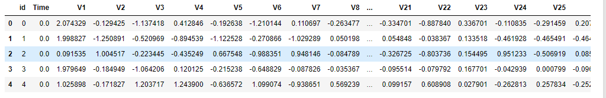
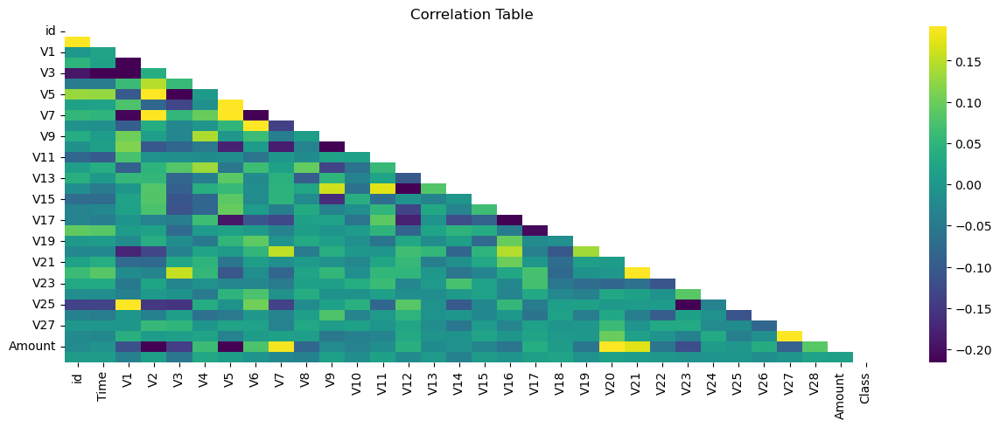
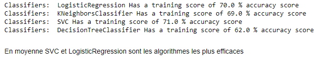

# Memoire ISDS
# Projet de détection des transactions frauduleuses

Ce projet vise à développer un modèle de détection des transactions frauduleuses à l'aide de la régression logistique. L'objectif est d'identifier les transactions potentiellement frauduleuses dans un ensemble de données de transactions.

## Description du projet

Ce projet propose une solution de détection des transactions frauduleuses basée sur un modèle de régression logistique. Il utilise un ensemble de données de transactions pour entraîner le modèle et évaluer sa performance. L'objectif est d'aider les entreprises à détecter les transactions suspectes et à prendre des mesures préventives pour minimiser les pertes financières.

## Contenu du projet

Le projet contient les éléments qui suivent :

- [Mémoire](https://drive.google.com/file/d/1TdvaVXTq4_nmisiPGA9zMiKNXF9omowZ/view?usp=sharing) : ce fichier détaille la méthodologie utilisée ainsi que les résultats obtenus.
- [train.csv](https://drive.google.com/file/d/1jOXBGoaOWDcn8KV3D1f3Vy87molEfHsp/view?usp=sharing) : ce fichier contient les données d'entraînement utilisées pour ajuster le modèle.
- [test.csv](https://drive.google.com/file/d/1KUm7q-bw6tP3JGpudfn9rp7El_gHygUn/view?usp=sharing) : ce fichier contient les données de test utilisées pour évaluer les performances du modèle.
- [code.ipynb](https://github.com/zouzou456/Memoire_ISDS/blob/main/code.ipynb) : ce fichier contient le code principal du modèle de régression logistique.

## Utilisation

Pour exécuter ce projet, vous devez disposer des dépendances suivantes :

- Python 3.7 ou une version ultérieure
- Jupyter Notebook
- Les bibliothèques Python suivantes : numpy, pandas, scikit-learn

Pour utiliser le modèle de régression logistique, ouvrez le fichier `code.ipynb` :

Le code chargera les données d'entraînement à partir du fichier `train.csv` et effectuera l'ajustement du modèle de régression logistique. Il utilisera ensuite les données de test à partir du fichier `test.csv` pour évaluer les performances du modèle. Les résultats obtenus sur l'ensemble de test, y compris la précision, le rappel et la F-mesure, seront affichés à la fin de l'exécution du code. Il délivrera un fichier submission avec les valeurs mises à jour avec la méthode utilisée

## Présentation des données du challenge

Avant de présenter le modèle de détection des transactions frauduleuses, il est important de comprendre les données utilisées dans ce projet. Le jeu de données est un ensemble de données qui contient des informations sur les transactions effectuées par des utilisateurs de cartes de crédit. Chaque transaction est décrite par un ensemble de variables telles que le montant de la transaction, la date et l'heure, le pays, ainsi que des caractéristiques anonymisées des utilisateurs. Le jeu de données est étiqueté, ce qui signifie qu'il indique si chaque transaction est frauduleuse (classe positive) ou légitime (classe négative).

Cependant, il est important de noter que le jeu de données est déséquilibré, avec un nombre beaucoup plus élevé de transactions légitimes que de transactions frauduleuses. On peut le voir sur l'image suivante où sont calculées les proportions respectives de transactions légitimes et frauduleuses

Cela ajoute une difficulté supplémentaire à la classification, car les modèles doivent être capables de détecter efficacement les rares cas de fraudes parmi les transactions normales.

## Le choix de la régression logistique 

La régression logistique est une méthode couramment utilisée pour la classification binaire, même dans le cas de problèmes déséquilibrés. Voici quelques raisons pour lesquelles la régression logistique est appropriée pour de tels problèmes :

1. Gestion des données déséquilibrées : Dans un problème de classification binaire, il est fréquent d'avoir un déséquilibre entre les classes, c'est-à-dire un nombre beaucoup plus élevé d'exemples d'une classe par rapport à l'autre. La régression logistique est capable de traiter ce déséquilibre en ajustant les poids des échantillons lors de l'apprentissage du modèle. Cela permet de prendre en compte la distribution des classes et d'éviter un biais vers la classe majoritaire.

2. Interprétabilité des résultats : La régression logistique fournit des coefficients qui permettent d'interpréter l'importance des différentes variables dans la classification. Cela peut aider à comprendre les facteurs qui contribuent le plus à la prédiction de la classe cible. Cette interprétabilité est particulièrement utile dans les problèmes de classification déséquilibrés, car elle permet de détecter les facteurs qui influencent davantage la classe minoritaire.

3. Flexibilité et souplesse : La régression logistique peut être adaptée à différentes situations en modifiant les paramètres du modèle. Par exemple, des techniques telles que la régularisation peuvent être utilisées pour contrôler la complexité du modèle et éviter le surajustement. De plus, des mesures de performance spécifiques aux problèmes de classification déséquilibrés, telles que la précision, le rappel et la F-mesure, peuvent être utilisées pour évaluer la performance du modèle.

4. Robustesse aux données manquantes : La régression logistique est également robuste aux données manquantes. Si certaines variables présentes dans l'ensemble de données sont manquantes pour certains exemples, la régression logistique peut utiliser les informations disponibles pour estimer les coefficients. Cela permet d'éviter l'exclusion d'échantillons qui pourraient être précieux pour la classification, en particulier dans les problèmes déséquilibrés où les échantillons de la classe minoritaire sont rares.

## Matrice de corrélation

Pour mieux comprendre les relations entre les différentes variables dans les données, une matrice de corrélation peut être utilisée. La matrice de corrélation permet de visualiser les corrélations entre les variables numériques.

Cette matrice de corrélation montre la corrélation entre les différentes variables.

## Comparaison avec d'autres approches

Le code fournit également une comparaison des performances du modèle de régression logistique avec d'autres approches de classification telles que la régression logistique, les k plus proches voisins, le support vector classifier et le decision tree classifier. Les résultats de chaque approche sont affichés et permettent de comparer les performances en termes de précision, de rappel et de F-mesure.

Cette image présente les différences de résultats entre les différentes approches de classification. Elle met bien en évidence que la régression logistique est la plus efficace des méthodes

## Améliorations possibles et limites de l'étude

Bien que le modèle de régression logistique ait montré de bonnes performances dans la détection des transactions frauduleuses, il existe encore des améliorations possibles. Par exemple, l'utilisation de techniques d'échantillonnage telles que l'oversampling ou le undersampling pourrait permettre de mieux gérer les déséquilibres de classe présents dans les données. De plus, l'ajout de variables supplémentaires ou l'exploration d'autres modèles pourraient également améliorer les performances.

Il convient également de noter que cette étude présente certaines limites. Les résultats obtenus dépendent des données utilisées, il est donc important de s'assurer que les données sont représentatives et de qualité. De plus, cette étude se concentre sur un modèle de régression logistique parmi d'autres approches possibles, il est donc recommandé d'explorer d'autres modèles et techniques pour obtenir une meilleure compréhension du problème de détection de fraudes.

## Conclusion

En conclusion, ce projet présente une mise en œuvre d'un modèle de régression logistique pour la détection des transactions frauduleuses. Le modèle obtient de bonnes performances en termes de précision, de rappel et de F-mesure. Cependant, des améliorations peuvent encore être apportées et il est important de prendre en compte les limites de cette étude. Ce projet fournit une base solide pour la détection des transactions frauduleuses et peut servir de point de départ pour de futures améliorations.
